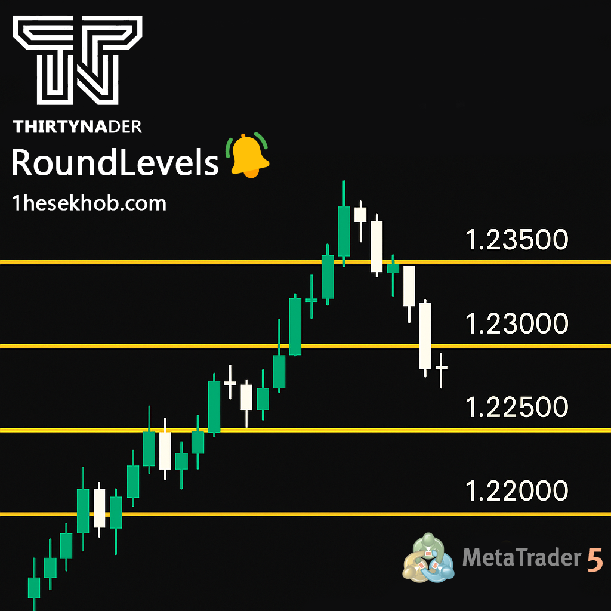

# Thirtynader Round Levels with Alert

This tool automatically draws psychological round number levels on the chart—powerful zones where price often reacts. It also sends an alert when price approaches one of these key levels, helping traders stay sharp and focused.

## 🔧 Main Features
- Adjustable level spacing (in points)
- Number of levels above and below price
- Built-in MetaTrader alert system
- Customizable colors, line style, and thickness

## 💡 Why it matters
Round numbers act like magnets in the market. Whether you trade **XAUUSD**, **US30**, or any other asset, these levels often align with areas of **support/resistance**, **liquidity**, and **price reaction**. Combine it with your strategy like price action, MTR, or candlestick patterns, and it becomes a powerful confirmation tool.

The built-in **sound alert system** ensures you don’t miss key trading opportunities as price approaches these psychological levels.

## 📸 Screenshots

### 🔹 Visual overview

---

### 🔹 Examples of trading setups around these levels

---

### 🔹 Customizable Inputs

## 📥 Download

👉 [Download Indicator (.ex5)](https://github.com/Thirtynader/Thirtynader-RoundLevels/releases/download/v1.0.0/Thirtynader-RoundLevels.ex5)

## 📂 How to Use
1. Copy the `.ex5` file into your MetaTrader 5 `Indicators` directory.
2. Restart MetaTrader or refresh the Navigator.
3. Attach the indicator to your chart and customize the settings to your preference.

> **Note:** Source code is not provided to protect proprietary logic.

## 📃 License
This indicator is distributed as a compiled binary only. Redistribution or decompilation is strictly prohibited.
